<p align="center">
  
</p>

<h1 align="center">Bless Them</h1>

<p align="center"><em>Speak Scripture over the people you love.</em></p>

<p align="center">
  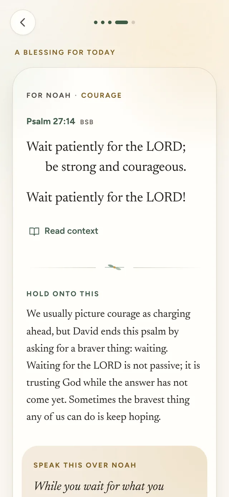
  &nbsp;
  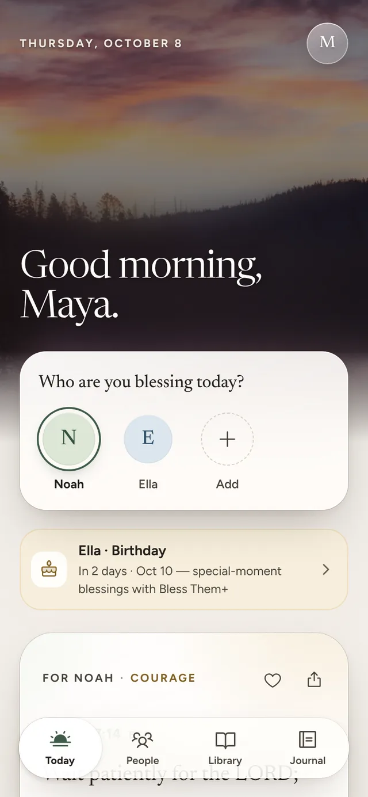
  &nbsp;
  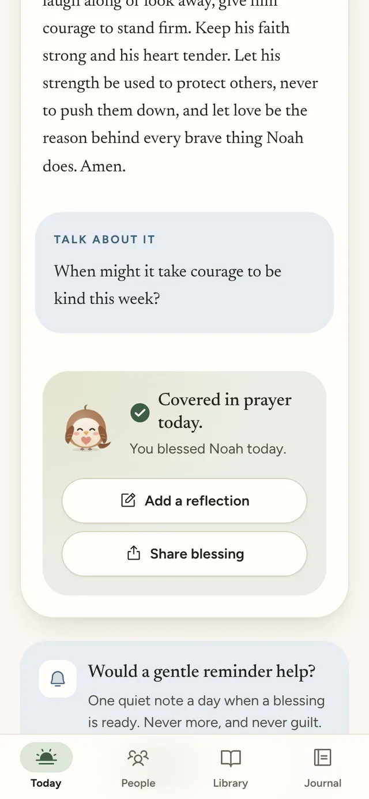
</p>

Bless Them is a calm, premium companion for Christian parents, grandparents and spouses. Every day it prepares one personal blessing for each person you love, built on a passage of Scripture that suits their age and what they are facing. The daily practice takes about a minute:

> **Person → Need → Scripture → Blessing → Prayer → Done.**

You choose who you are blessing. The app offers a verified passage, a short thought to hold onto, a blessing written in their name, a prayer, and a question to talk about together. When you are done, tap **I prayed this** and that person is *covered in prayer today*.

Bless Them is not a Bible reader, a streak machine or an AI oracle. It never invents Scripture, never claims to speak for God, and never promises outcomes.

---

## Contents

- [The experience](#the-experience)
- [Quick start](#quick-start)
- [Scripts](#scripts)
- [How it is built](#how-it-is-built)
- [Scripture integrity](#scripture-integrity)
- [Privacy and safety](#privacy-and-safety)
- [Accessibility](#accessibility)
- [Project structure](#project-structure)
- [Documentation](#documentation)
- [Credits and licenses](#credits-and-licenses)

## The experience

<table>
  <tr>
    <td align="center">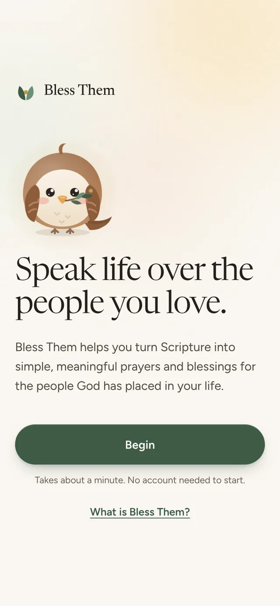<br><sub>Welcome</sub></td>
    <td align="center">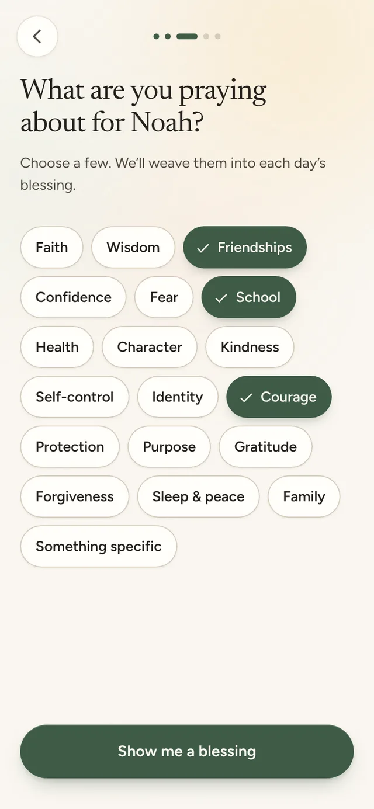<br><sub>A blessing before an account</sub></td>
    <td align="center">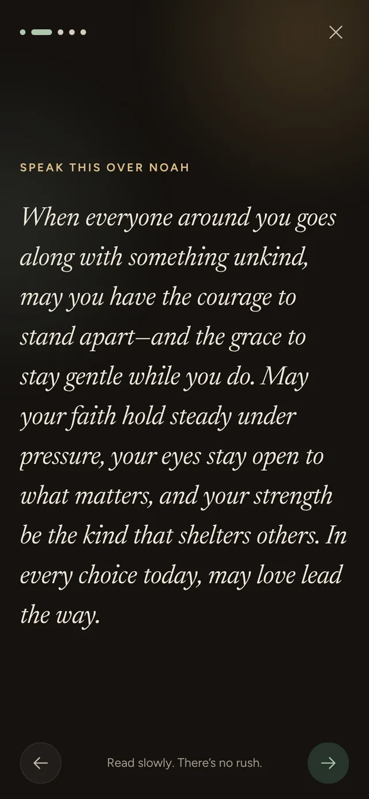<br><sub>The blessing moment</sub></td>
    <td align="center">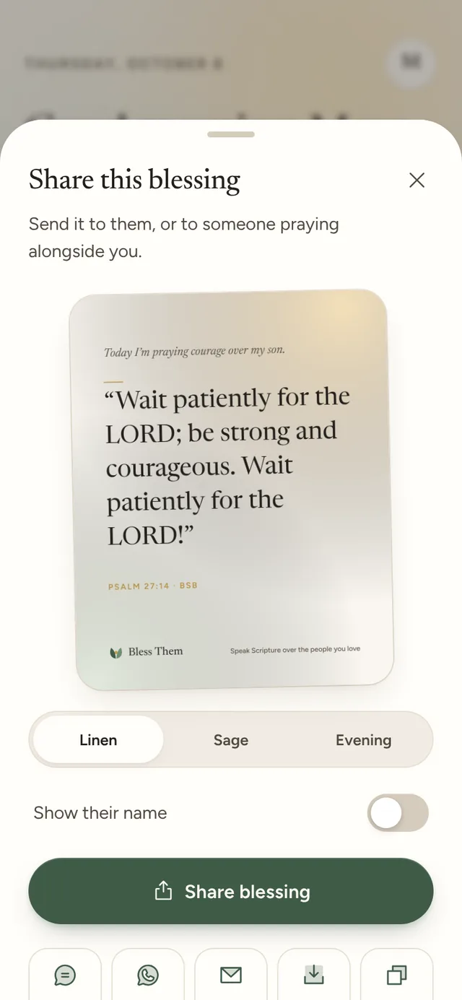<br><sub>Share cards</sub></td>
  </tr>
  <tr>
    <td align="center">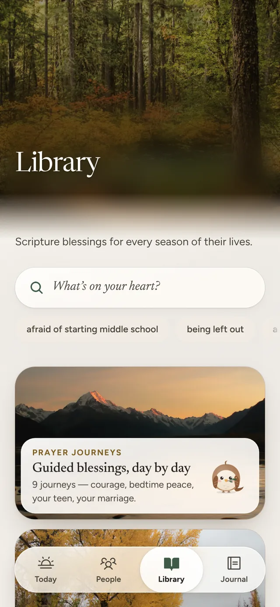<br><sub>Library</sub></td>
    <td align="center">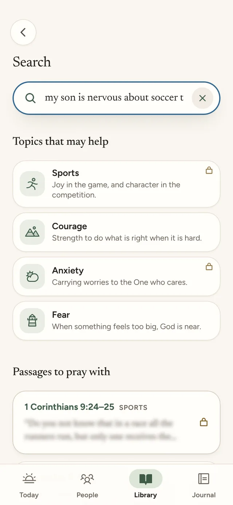<br><sub>Search</sub></td>
    <td align="center">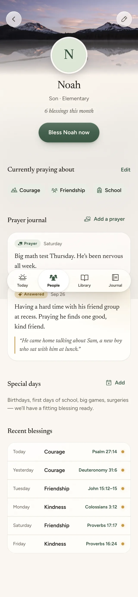<br><sub>People</sub></td>
    <td align="center">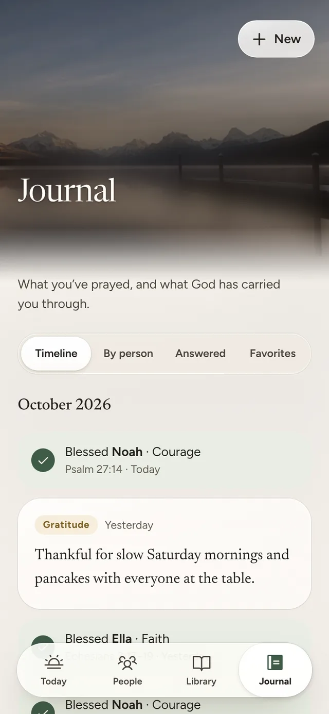<br><sub>Journal</sub></td>
  </tr>
  <tr>
    <td align="center">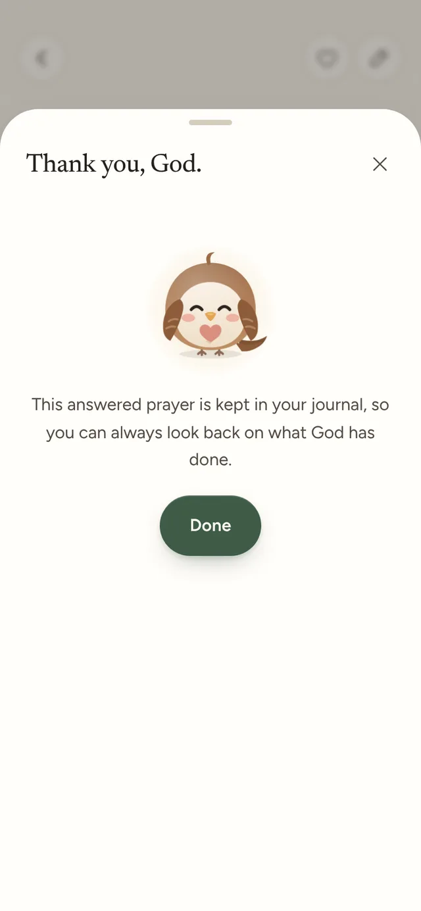<br><sub>Answered prayer</sub></td>
    <td align="center">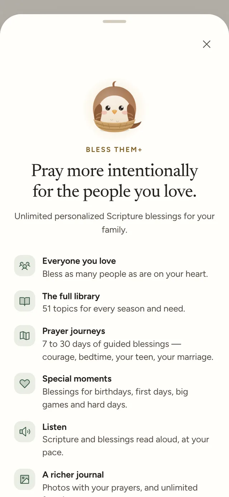<br><sub>An honest paywall</sub></td>
    <td align="center">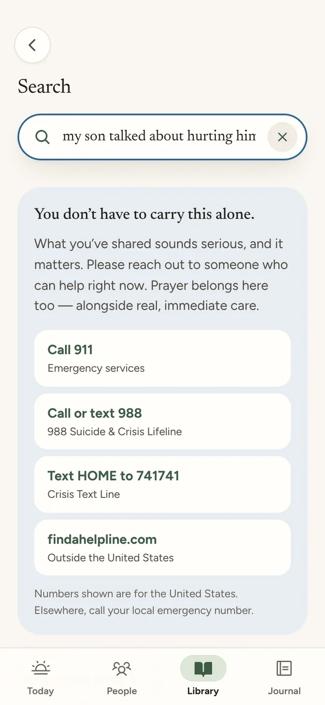<br><sub>Help comes first</sub></td>
    <td align="center">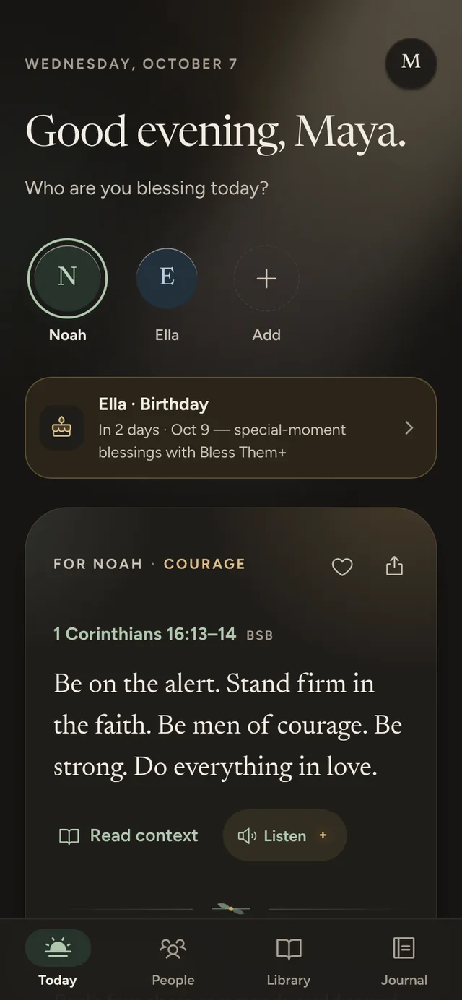<br><sub>Dark mode</sub></td>
  </tr>
  <tr>
    <td align="center">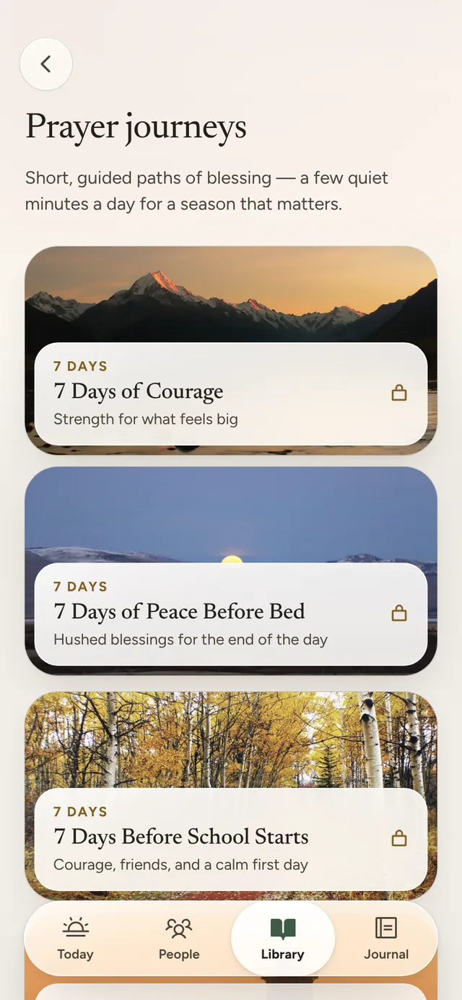<br><sub>Prayer journeys</sub></td>
    <td align="center">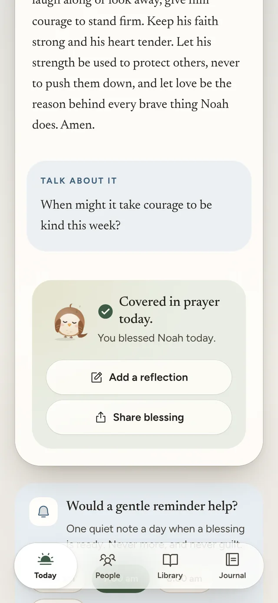<br><sub>Pip, after a night prayer</sub></td>
    <td align="center" colspan="2">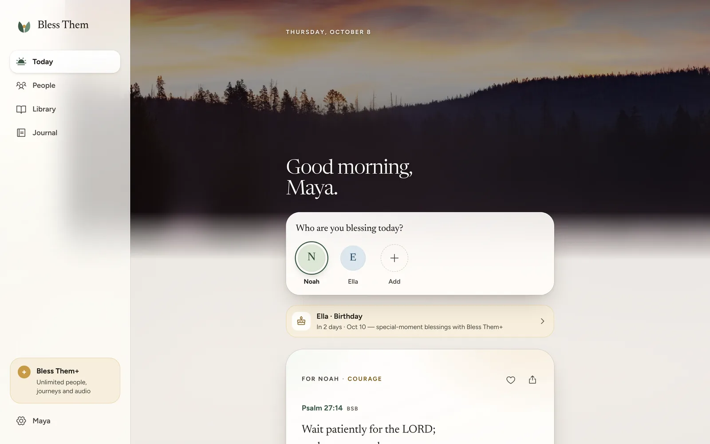<br><sub>Desktop</sub></td>
  </tr>
</table>

**What is in the app**

- **Meaning before an account.** Onboarding asks who you are praying for and what they need, then delivers a real, personal blessing. Only after that does it offer to save your family with Apple, Google or an email link. Guests can keep going and never lose anything.
- **Real places, frosted glass.** Every screen sits in a quiet landscape, under warm frosted glass. There are nineteen hand-picked photographs, all public domain, CC0 or CC BY and credited in the app. Today follows the clock, from first light over a meadow to a crescent moon at night. Each journey, collection, topic and person has a place of their own.
- **Today.** One blessing per person per day. Choices are deterministic for each person and date, suit their age and relationship, follow their focus topics and today’s concern, and do not repeat a passage within a week.
- **Pip the sparrow.** A small companion drawn from Matthew 10:29. Pip greets you, rests in empty states, celebrates when someone is covered in prayer, and dozes off after a late-night prayer. Pip never speaks for God and never nags.
- **The blessing card.** Scripture, *Hold onto this*, *Speak this over {name}*, a prayer, and *Talk about it*. Read-aloud and the passage’s wider context are one tap away. The translation, BSB or WEB, is a setting.
- **The library.** About 50 topics in seven parts of life: *Their Faith*, *Their Heart*, *Their Mind*, *Their Relationships*, *Hard Seasons*, *Their Future* and *Everyday Life*. Seasonal collections and guided journeys sit alongside them, from *7 Days of Courage* to *Blessing Your Marriage*. Search accepts plain language, such as “my son is nervous about tryouts”.
- **People and special moments.** Profiles hold age, pronouns, focus topics and an optional private note. Birthdays, first days and surgeries get blessings written for the occasion.
- **Journal.** Reflections, prayer requests, gratitude and notes, with optional photos. Requests can be marked answered, and favorites are kept.
- **Rhythm, not streaks.** The app shows a gentle record of the days you prayed. Missing a day costs nothing.
- **Bless Them+.** The full library, journeys, collections, read-aloud, journal photos and occasion blessings cost $34.99 a year (7-day free trial) or $4.99 a month. Free use stays meaningful: daily blessings for two people, forever.
- **Works offline and installs like an app** on iOS, Android and desktop.

## Quick start

Requires Node 20 or newer.

```bash
npm install
npm run dev          # http://localhost:5173
```

The app opens at **Welcome**. Everything you create stays in this browser, and **Settings › Privacy & your data › Delete everything** starts over. In development builds, `window.__bt.store` exposes the store in the browser console for debugging.

Production build and preview:

```bash
npm run build        # verifies Scripture, typechecks, bundles, generates the service worker
npm run preview      # http://localhost:4173, offline support enabled
```

## Scripts

| Command | What it does |
| --- | --- |
| `npm run dev` | Vite dev server with hot reload |
| `npm run build` | Scripture check, then typecheck, then production build with the service worker |
| `npm run preview` | Serves the production build |
| `npm test` | Unit tests (Vitest): content, Scripture, engine, store |
| `npm run e2e` | Playwright flows A–G on an iPhone 13 viewport, an axe accessibility audit, and the contrast of words on photographs, measured as rendered |
| `npm run test:schema` | Row-level security and plan-limit tests for `supabase/schema.sql`. Needs `DATABASE_URL` for a Postgres server. |
| `npm run check` | Typecheck, contrast audit and unit tests |
| `npm run contrast` | WCAG contrast audit of every color token pairing, in light and dark |
| `npm run lint:content` | Lints curated blessings against the full Bible texts. Downloads the sources once. |
| `npm run scripture` | Rebuilds the verified Scripture subset, or verifies the committed one when sources are absent |
| `npm run verse -- "PSA 23:1-3"` | Prints a verified passage from either translation |
| `npm run icons` | Regenerates the app icons from the brand mark |
| `npm run scenery` | Grades and encodes the photographs (AVIF and WebP), and regenerates their typed manifest. Downloads originals once. |

## How it is built

A web-first, installable **PWA**:

- **Framework:** React 19, TypeScript (strict) and Vite.
- **State:** Zustand, persisted on the device. Journal photos go to IndexedDB.
- **Motion:** spring-based animation with Motion.
- **Type:** Newsreader for Scripture and Figtree for interface text.
- **Scenery:** credited photographs graded as one set and served as AVIF with a WebP fallback at the right width, with a tiny blurred placeholder inline. Surfaces are frosted glass that turns solid with Reduce Transparency.
- **Offline:** a Workbox service worker precaches the app shell, fonts and every verified passage, and caches each photograph the first time it is seen.

The core is pure TypeScript, so the same code can later ship as native iOS and Android apps through Capacitor.

Content is code. Each curated blessing pairs a verified reference with a short thought, a blessing template, a prayer, a conversation prompt and suitability rules. The personalization engine is deterministic and runs entirely on the device: no account, network or AI call is needed to bless someone.

Accounts and purchases sit behind small service interfaces (`src/services/auth.ts`, `src/services/purchases.ts`). This build ships local implementations: device-only accounts, and a purchase preview that **never charges**. The production design uses Supabase for auth and sync with row-level security, and RevenueCat or Stripe for billing. It is documented in [docs/ARCHITECTURE.md](docs/ARCHITECTURE.md), and the schema is in [supabase/schema.sql](supabase/schema.sql).

## Scripture integrity

Every word of Scripture in the app comes from a public-domain translation and is checked mechanically.

- **Sources.** The **Berean Standard Bible** (default) and the **World English Bible** come from the publishers’ USFM files on eBible.org.
- **Verification.** Before extraction, `scripts/lib/usfm.mjs` parses every verse and compares it with the publisher’s plain-text edition. All 31,086 BSB verses match exactly. In the WEB, 26 verses differ only in formatting: the acrostic letters in Psalm 119, the speaker labels in the Song of Songs, and the spacing of one dash in Psalm 68:32. No word differs.
- **What ships.** Only the verses that curated content references are extracted, into `src/content/scripture/*.json`. The build fails if any referenced verse is missing or differs from the source.
- **At runtime.** `getPassage()` returns nothing rather than a partial passage. If a passage cannot be shown, the card says so plainly and shows nothing in its place.
- **Content rules.** Reflections and blessings paraphrase Scripture rather than quote it, because wording differs between translations. The content linter rejects claims of divine revelation, promised outcomes, prosperity language and gamified tone. [docs/CONTENT_GUIDE.md](docs/CONTENT_GUIDE.md) has the full rules.

## Privacy and safety

- **Private by default.** Names, prayers, notes, journal entries and searches stay on the device. Analytics events are typed and carry no content: no names, no prayer text, no queries. They can be switched off in Settings.
- **Export and delete.** Settings exports everything as JSON or erases it in one step.
- **Crisis handling.** If a parent types something that suggests self-harm, abuse, violence or a medical emergency, the app answers with compassion and real help first, such as 988, 911 or Childhelp. Scripture may follow gently, as a complement, never a substitute. Detection runs only on the device.
- **Pastoral notifications.** Reminders read like “A blessing for Noah is ready.” The app never says “Don’t lose your streak!”

## Accessibility

- Body and supporting text meet WCAG **AAA** contrast on every surface in both themes, including glass over every photograph, and metadata meets AA. `npm run contrast` enforces this.
- Words set on photographs are measured as rendered, against the brightest part of the photograph behind them: titles and the greeting at least 4.5:1 (AAA for large text), reading and supporting text 7:1. The end-to-end suite re-checks the hardest cases.
- Supports iOS Dynamic Type and an in-app text size control. Tap targets are at least 44 points, and the app works with screen readers. Reduced motion and Reduce Transparency are honored from the system setting or from in-app settings.
- Every Playwright run includes an axe audit of the main screens with zero serious or critical violations.

## Project structure

```
src/
  app/            App shell, navigation bar, route fallback
  brand/          Logo mark
  content/        Taxonomy, journeys, curated blessings, verified Scripture,
                  scenery sources and the generated photo manifest
  data/           Data model and the persisted store
  design/         Design system components (Button, Sheet, Toast, selectors…)
  engine/         Personalization, composition, search, safety, rhythm, journeys
  features/       Screens: today, blessing, onboarding, people, library,
                  journeys, journal, settings, premium, share, safety, …
  hooks/          Small React hooks
  lib/            Dates, ids, seeded randomness, text helpers
  mascot/         Pip the sparrow
  services/       Auth, purchases, analytics, notifications, haptics,
                  speech, photos, theme, share, service worker registration
  styles/         Design tokens and base styles
  sw.ts           Service worker
public/scenery/   Graded photographs, AVIF and WebP at three widths each
scripts/          Scripture and scenery pipelines, content linter, contrast audit, icons
e2e/              Playwright flows A–G, the accessibility audit, words on photographs
docs/             Architecture, design system, content guide, QA
supabase/         Production database schema with row-level security
```

## Documentation

- [Architecture](docs/ARCHITECTURE.md) covers platform decisions, data and sync, auth, billing, notifications, content boundaries, analytics and performance.
- [Design system](docs/DESIGN_SYSTEM.md) covers tokens, scenery and glass, type, color and contrast, motion, components, Pip and the app icon.
- [Content guide](docs/CONTENT_GUIDE.md) covers voice, theology guardrails, templates and how to add a blessing.
- [QA](docs/QA.md) covers the design QA checklist, flow results and known limitations.

## Credits and licenses

- **Scripture:** the Berean Standard Bible and the World English Bible are both in the public domain. “World English Bible” is a trademark of eBible.org.
- **Fonts:** [Newsreader](https://github.com/productiontype/Newsreader) and [Figtree](https://github.com/erikdkennedy/figtree), under the SIL Open Font License.
- **Icons:** [Phosphor](https://phosphoricons.com), under the MIT license.
- **Photography:** nineteen landscapes from Flickr by the US National Park Service, the US Forest Service, the US Fish and Wildlife Service and independent photographers. Twelve carry the Public Domain Mark, six are CC0, and one (“Oak Hill Snow Play 2019”, Kaibab National Forest) is [CC BY 2.0](https://creativecommons.org/licenses/by/2.0/). Every photograph is credited in *Settings › About › Photography*, with sources in [`src/content/scenery/sources.json`](src/content/scenery/sources.json). The photographs are graded and resized; none is generated.
- **Pip the sparrow and the Bless Them mark** were drawn for this project. The sparrow comes from Matthew 10:29: *not one of them will fall to the ground apart from the will of your Father.*

The application code is proprietary. All rights reserved.
