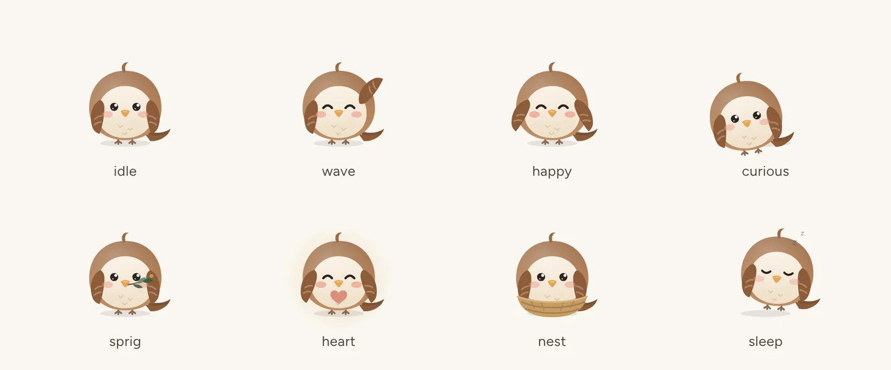

# Design system

**Warm sacred minimalism.** Bless Them should feel like morning light across a linen tablecloth: soft, quiet and unhurried. Scripture is the hero of every screen. Everything else steps back.

Tender but strong. Faithful but modern. Beautiful but restrained. Christian without becoming cliché.

- [Principles](#principles)
- [Color](#color)
- [Scenery](#scenery)
- [Glass](#glass)
- [Typography](#typography)
- [Space, shape and elevation](#space-shape-and-elevation)
- [Motion](#motion)
- [Haptics](#haptics)
- [Iconography](#iconography)
- [Components](#components)
- [Pip the sparrow](#pip-the-sparrow)
- [The mark and app icon](#the-mark-and-app-icon)
- [Voice and microcopy](#voice-and-microcopy)
- [Accessibility](#accessibility)

## Principles

1. **One quiet minute.** Every screen serves the ritual: Person, then Need, then Scripture, then Blessing, then Prayer, then Done. If something does not help a parent bless someone, it waits a tap away.
2. **Scripture is the hero.** It gets the largest serif, the most space and the calmest surface. Nothing decorative ever sits on top of the words.
3. **One primary action per screen.** Secondary actions are ghost buttons or icons, never a second loud button.
4. **Real places, not decoration.** Depth comes from real photographs of quiet places, frosted glass and soft shadow, not from illustration, borders or badges. Words always sit on calm tone, never on busy detail.
5. **Calm by default.** Motion is slow enough to feel and quick enough to never wait on. Nothing flashes, bounces or nags.
6. **Every state is designed.** Empty, loading, offline, error and locked states each have their own words, and Pip where it helps.

## Color

Every color comes from semantic tokens in [`src/styles/tokens.css`](../src/styles/tokens.css). Components never use a raw hex value. Dark mode redefines the same tokens rather than adding new ones.

| Role | Token | Light | Dark |
| --- | --- | --- | --- |
| Page | `--color-bg` | `#faf7f1` warm ivory | `#161412` deep warm charcoal |
| Card | `--color-surface` | `#fffdf9` | `#201d1a` |
| Well, input | `--color-surface-sunken` | `#f1ece3` soft stone | `#110f0d` |
| Blessing, prayer | `--color-surface-sand` | `#f4ebdd` | `#2a2420` |
| Covered in prayer | `--color-surface-sage` | `#e9eee4` | `#1d2620` |
| Talk about it | `--color-surface-blue` | `#e7edf1` | `#1b2329` |
| Special moments | `--color-surface-gold` | `#f6eedc` | `#2b2519` |
| Text | `--color-text` | `#23201c` | `#f2ece3` |
| Supporting text | `--color-text-secondary` | `#4a443c` | `#cbc2b6` |
| Metadata | `--color-text-tertiary` | `#655d53` | `#a59c90` |
| Brand (primary actions) | `--color-brand` | `#3e5b47` deep sage | `#afc8ae` |
| Decorative gold | `--color-gold` | `#c99a46` | `#d4ae6a` |
| Focus ring | `--color-focus` | `#2f6690` | `#8fc1e3` |
| Destructive | `--color-danger` | `#9a3a2c` | `#f0a898` |

**Usage rules:**

- **Sage** carries meaning: primary buttons, selection, links, and "covered in prayer".
- **Gold** is light, never text. Gold text uses `--color-gold-text` instead.
- **Blue** marks conversation (*Talk about it*), and **rose** is reserved for love and the heart pose.
- Danger red appears only on destructive confirmations, never as an alarm.

**Contrast.** `npm run contrast` checks every text token against every surface it can sit on, in both themes, and fails the build below target. That includes glass over the darkest and brightest part of every photograph:

| Pairing | Light | Dark | Target |
| --- | --- | --- | --- |
| Text on any surface | 13.7–16.0 | 12.9–16.3 | AAA, 7:1 |
| Supporting text | 8.1–9.5 | 8.6–10.9 | AAA, 7:1 |
| Metadata | 5.5–6.4 | 5.6–7.1 | AA, 4.5:1 |
| Brand text (links, selection) | 6.4–7.4 | 8.5–10.7 | AA, 4.5:1 |
| Label on primary button | 7.0–9.6 | 7.9–10.7 | AAA, 7:1 |
| Focus ring | 5.7–6.0 | 8.7–9.5 | 3:1 (non-text) |
| Text on glass, over scenery | 12.2–15.7 | 11.7–14.4 | AAA, 7:1 |
| Supporting text on glass, over scenery | 7.2–9.3 | 7.8–9.6 | AAA, 7:1 |

Words set straight onto a photograph are measured as rendered instead (see [Scenery](#scenery)).

## Scenery

Every screen sits in a real place. Nineteen landscape photographs, public domain, CC0 or CC BY, were chosen by hand for quiet: wide skies, still water, meadows, first light. Nothing is generated. Each is credited in *Settings › About › Photography* ([`sources.json`](../src/content/scenery/sources.json)).

**One family.** `npm run scenery` gives every photograph the same gentle grade (lifted blacks, eased saturation, a warm wash; a cooler one at night) so the set reads as one collection. It writes AVIF with a WebP fallback at three widths, and generates a typed manifest ([`scenes.ts`](../src/content/scenery/scenes.ts)) holding each scene's focal point, average colour, the darkest and brightest tenth of its tones (for the contrast audit) and a 24-pixel blurred placeholder.

**The sky follows the clock.** The app's own backdrop is the current daypart's scene, blurred to a wash of colour under a linen veil, with a faint grain:

| Daypart | Hours | Scene |
| --- | --- | --- |
| Morning | 5:00–12:00 | First light over a meadow |
| Day | 12:00–17:00 | A wildflower meadow under open sky |
| Evening | 17:00–21:00 | Golden grass below the mountains |
| Night | 21:00–5:00 | A crescent moon over still water |

**Where photographs appear:**

- **Today.** The daypart's scene behind the greeting, drifting slowly (48 s) and sliding a little slower than the page on scroll.
- **Headers.** Library, People, Journal, each journey, collection and topic (by category) open on their own photograph.
- **Person pages.** Each person has a place of their own behind their portrait, like a contact poster. It follows from their id, so it never changes.
- **Photo cards.** Journeys and the season's collection in the Library: a photograph with a glass caption resting on it.
- **The reading view.** Today's scene, blurred and dimmed, behind the words.
- **Welcome, Bless Them+ and share cards.** The daypart's scene behind the welcome; a postcard with Pip on the Plus page; four photographic share-card styles (Dawn, Meadow, Golden, Moonlit) beside Linen and Sage.

**Words on photographs.** A photograph never sits behind words at full strength:

- The photograph stays solid behind titles and dissolves into the page only below them, on an eased fade.
- A progressive blur under titles and the greeting smooths bright detail, and a warm scrim deepens the tone behind them.
- Small text goes on glass or below the photograph. The only small text set on a photograph is an eyebrow, the date and the welcome wordmark.

`e2e/scenery.spec.ts` measures these as rendered. It hides each element's text, captures what lies behind it, and checks the text colour against the brightest 2% of those pixels, ignoring text shadows. A sweep of every scene at every hour, in both themes and at 390 and 1280 px, set the targets and picked the hardest cases for the test ([QA.md](QA.md#words-on-photographs)):

| Words | Worst measured, light / dark | Target |
| --- | --- | --- |
| Header titles, the greeting (large) | 5.15 / 6.68 | 4.5:1 (AAA, large text) |
| Header subtitles, names on the tray | 7.03 / 8.41 | 7:1 (AAA) |
| Scripture and blessing in the reading view | 7.50 / 7.51 | 7:1 (held to body text) |
| Eyebrows, the date, reading hints | 4.87 / 5.02 | 4.5:1 (AA, as metadata) |

**Performance.** Photographs load lazily, except the one above the fold. They are never precached: the service worker caches them as they are seen (up to 90, kept for a year), so the install stays small. Offline, a photograph not yet seen shows its blurred placeholder, which ships inside the app.

## Glass

Surfaces are frosted glass over the scenery: warm, translucent and lit from above.

| Token | Use |
| --- | --- |
| `--surface-glass` | Cards and rows over the backdrop (80% fill) |
| `--surface-glass-strong` | Reading surfaces: the blessing card, sheets, the Today tray, photo-card captions (90%) |
| `--surface-glass-thin` | Small controls floating on photographs (62%) |
| `--glass-fill-chrome` | The tab bar and the bar a title condenses into on scroll (74%) |
| `--glass-filter` | `blur(24px) saturate(170%)` |
| `--glass-sheen`, `--glass-rim`, `--glass-edge` | Light from above, a bright inner edge and a hairline outline |

Each material is a sheen gradient over a tinted fill. Dark mode redefines the fill (warm charcoal) and the light (dimmer).

**Real blur is used sparingly.** `backdrop-filter` is reserved for things that float over a photograph or over content: the tab bar, sheets, the Today tray, the blessing card, photo-card captions and controls on photographs. Cards in long lists use the same tinted fill over the already-blurred backdrop, so scrolling stays smooth.

**Signature pieces:**

- **The tab bar** is a floating glass capsule, lifted off the home indicator. A brighter lens glides to the selected tab on `spring.soft`.
- **Condensing titles.** When a page's title scrolls away, a slim frosted bar fades in with the title in serif, the back button and the page's actions, as in iOS.
- **The reading view** tints its own glass dark at every hour (`data-glass` re-derives the materials for a local tint).

**Reduce Transparency.** *Settings › Text, motion & haptics › Reduce transparency*, or the system setting, makes every material solid and the backdrop opaque.

## Typography

| Family | Used for | Why |
| --- | --- | --- |
| **Newsreader** (variable, optical sizes, italic) | Scripture, blessings, prayers, greetings, page titles | A literary serif with real optical sizing. It reads like a well-made book at 23 px and stays crisp at 13 px. |
| **Figtree** (variable) | Interface text: buttons, labels, metadata | Friendly geometric sans, very legible, warm without being cute |

Both fonts are self-hosted through `@fontsource-variable` and precached for offline use.

| Token | Size | Use |
| --- | --- | --- |
| `--text-hero` | 44 | Onboarding statements |
| `--text-display` | 36 | Greeting ("Good evening, Maya.") |
| `--text-title-1` | 30 | Page titles |
| `--text-title-2` | 24 | Section and sheet titles |
| `--text-title-3` | 19 | Card titles |
| `--text-scripture` | 23 | Scripture on the blessing card |
| `--text-blessing` | 21 | *Speak this over {name}* |
| `--text-reading` | 18 | Serif body: reflection, prayer, context |
| `--text-body` | 16 | Interface body |
| `--text-callout` | 15 | Secondary interface text |
| `--text-caption` | 13 | Metadata |
| `--text-overline` | 12 | Eyebrows (`FOR NOAH · COURAGE`), tracked uppercase |

**Leading:** `1.15` for display, `1.3` for titles, `1.5` for the interface, and `1.62` for reading.

**Scaling.** Every size multiplies by `--ts`. That is the in-app text size setting (Settings › Text, motion & haptics), and it can follow iOS Dynamic Type through `-apple-system-body`. Sizes run from 90% to 140%.

**Scripture keeps its shape.** Poetry keeps its line breaks and indents, psalm superscriptions are set as quiet headings, and quotation marks are balanced when an excerpt begins mid-speech.

## Space, shape and elevation

- **Grid:** spacing follows a 4/8 grid, `--space-1` (4 px) to `--space-20` (80 px). Page gutters are fluid, `clamp(16px, 5.4vw, 28px)`, and reading content tops out at 600 px.
- **Touch targets:** at least 44 × 44 (`--touch-min`). The tab bar is a 64 px capsule floating 12 px above the safe area (`--nav-height`). Content clears it and the home indicator.
- **Radii:** 8, 12, 16, 22, 28 and 36, plus pills. The blessing card and sheets use 36, panels inside a card 28, and buttons and chips pills.
- **Shadows:** warm brown and very soft, never grey. They come in five steps, from `--shadow-xs` to `--shadow-lg`, plus an inset highlight. In dark mode, shadows deepen and surfaces lift with lighter fills instead.

## Motion

Motion should feel almost invisible. It confirms, guides and settles, and it never performs.

| Token | Value | Use |
| --- | --- | --- |
| `--dur-fast` | 180 ms | Press states, toggles, chips |
| `--dur-base` | 240 ms | Fades, small reveals |
| `--dur-slow` | 300 ms | Page transitions, sheets |
| `--dur-gentle` | 600 ms | Scene crossfades, the prayed glow |
| `--ease-out` | `cubic-bezier(0.22, 1, 0.36, 1)` | Default |
| `spring.ui` | stiffness 420, damping 34 | Selection ring, segmented controls, switches |
| `spring.soft` | stiffness 260, damping 30 | Cards and sheets |
| `spring.gentle` | stiffness 170, damping 22 | Celebration, with no overshoot |

**Signature moments:**

- **Choosing a person.** The selection ring glides between avatars with a shared `layoutId`, and the avatars breathe from 92% to 100% scale.
- **"I prayed this."** A soft double haptic. The button resolves into the *Covered in prayer today* card: a check draws itself, warm light blooms behind it, a few motes of light rise, and Pip appears, happy at first and then holding a small heart. Late at night, Pip settles down to sleep instead.
- **The blessing moment.** A full-screen reading view shows one part at a time in large type (Scripture, then the blessing, then the prayer), for reading aloud at a bedside. It dims at night. Swipe, tap or use the arrow keys to move on.
- **Pages.** They enter with an 8 px rise and a fade, and leave with a 4 px lift. Lists stagger by 60 ms.
- **Scenes.** Photographs fade in over their blurred placeholder (700 ms), breathe slowly (a 2–9% scale over 36–48 s) and crossfade when the daypart changes. The Today scene slides a little slower than the page on scroll.
- **The tab bar.** Its lens glides between tabs on `spring.soft`.
- **Titles.** A large title hands over to the slim glass bar as it scrolls away: the bar fades in and its title rises 6 px.

**Reduced motion.** The system setting, or *Settings › Text, motion & haptics › Reduce motion*, turns off every transform, the scenes' drift and parallax, the rising light after a prayer, and Pip's idle animation. Opacity fades remain so state changes stay perceivable.

## Haptics

Haptics are light and rare, used only at moments that matter (`src/services/haptics.ts`).

| Moment | Pattern |
| --- | --- |
| Selecting a person, chip or tab | `selection`: a single 6 ms tick |
| Saving a favorite or a journal entry | `light`: 10 ms |
| "I prayed this" | `success`: a soft double beat, 12–60–16 ms, never a buzz |

Android uses the Vibration API. iOS Safari has none, so the app toggles a hidden native switch, which produces the system selection haptic. Haptics can be turned off in Settings.

## Iconography

The app uses [Phosphor](https://phosphoricons.com) icons, chosen for their soft, rounded geometry.

- **Regular** is used for interface glyphs at 20–24 px.
- **Duotone** is used for topic and occasion icons, with a translucent sage or gold fill.
- **Fill** marks selected states: the active tab and a saved favorite.
- **Bold** is used for small affordances such as chevrons and checks.

Thin and light weights are never used and are stripped from the bundle. Icons are always `aria-hidden`, and the control carries the label.

## Components

All components live in [`src/design/`](../src/design). Each one handles its default, hover, pressed, focus-visible, disabled and loading states (where they apply) in both themes and at every text size.

| Component | Notes |
| --- | --- |
| `Button` | Variants `primary`, `secondary` and `ghost`; sizes `md` and `sm`. Supports `block`, `icon`, and a `loading` state that keeps its width. The pressed state scales to 98%. |
| `IconButton` | 44 px target. A required `label` becomes its accessible name. |
| `TextField`, `TextArea` | Label, hint and error message are tied to the input with `aria-describedby`. `TextArea serif` is used for journal writing. |
| `Switch` | `role="switch"`. The knob glides on `spring.ui`. |
| `Segmented` | A radiogroup with a gliding glass lens, used for journal views. |
| `ChoiceCard` | Large tappable options in onboarding, with a check on selection. |
| `TopicChip`, `TopicCard` | Duotone topic icon and a selected state. Plus topics show a small lock. |
| `PersonAvatar` | Serif monogram on one of eight soft hues, with a small check once the person is prayed for. A family shows a duotone group icon. |
| `PersonSelector` | "Who are you blessing today?" A radiogroup with arrow-key support. Names are read as "Noah, prayed for today". |
| `Sheet` | Bottom sheet on phones and centered dialog on wide screens. It traps focus, closes on Escape or a downward drag, and restores focus on close. |
| `ConfirmationSheet` | For destructive actions. It says exactly what will be removed. |
| `Toast` | Polite live region with one short sentence and an optional action. |
| `EmptyState`, `ErrorState` | Pip, a serif title, one sentence and one action. Errors never show raw messages. |
| `OfflineBanner`, `Skeleton`, `BlessingSkeleton` | Calm offline notice, and skeletons shaped like the content they stand in for. There are no spinners. |
| `Card`, `Section`, `SettingsGroup`, `SettingsRow` | Layout primitives on glass. Card tones are `plain`, `sand`, `sage`, `blue` and `gold`, each a tinted glass. |
| `PageHeader` | Title, eyebrow, subtitle, back and actions. With `scene`, the title sits on its photograph. On scroll it condenses into a slim glass bar (`condensedTitle` and `condenseAfter` adjust what it shows and when). |
| `SceneImage` | A photograph that arrives gracefully: AVIF or WebP at the right width, its blurred placeholder first, then a fade. Always decorative. |
| `SceneBackdrop` | The app's sky: the daypart's scene as a blurred wash under a veil and grain, crossfading when the hour turns. |
| `PhotoCard` | A photograph with a glass caption (kicker, title, body and an accessory such as a progress ring). |
| `Ornament` | A small leaf divider between card sections. |
| `ProgressDots`, `ProgressRing` | Onboarding steps and journey progress. |

## Pip the sparrow

<picture>
  <source media="(prefers-color-scheme: dark)" srcset="design/pip-poses-dark.webp">
  
</picture>

> Are not two sparrows sold for a penny? Yet not one of them will fall to the ground apart from the will of your Father. (Matthew 10:29)

Pip is a small, round house sparrow. The design comes from Jesus' words about sparrows, and from Psalm 84:3, where even the sparrow finds a home near God's altar. Pip is a reminder that small things are seen and held. Drawn in SVG ([`src/mascot/Pip.tsx`](../src/mascot/Pip.tsx)) in warm browns with a cream breast and rosy cheeks, Pip looks the same in both themes.

| Pose | When |
| --- | --- |
| `idle` | Default, resting |
| `wave` | Welcoming someone who has not added anyone yet |
| `happy` | Just prayed, plans, a gentle "you're all set" |
| `curious` | Not found, empty search, nothing here yet |
| `sprig` | Onboarding, the library and gifts. Pip carries an olive sprig, a sign of peace. |
| `heart` | Covered in prayer, answered prayer, the journal |
| `nest` | Empty lists that will fill: people, favorites, the journal |
| `sleep` | After a late-night prayer, when the day is done |

**Rules for Pip:**

- **Pip is a companion, never a voice.** Pip never speaks, never speaks for God, never gives advice and never nags.
- **Pip stays out of crisis and tender in hard seasons.** The safety screen has no mascot. After a prayer about grief, illness, fear or another hard season, Pip shows the heart and never the happy pose.
- **Pip never competes with Scripture.** Sizes run from 64 to 168 px, and the largest appear only in onboarding, where there is no passage on screen.
- **Pip moves slowly.** Pip breathes and blinks now and then, and all of it stops with reduced motion. Pip is always `aria-hidden`, so meaning never depends on Pip.

## The mark and app icon

  
  &nbsp;&nbsp;
  

**The mark** is two leaves cradling a small golden light: covering, growth and blessing. It reads as hands held open in prayer without drawing hands. Its forms are simple enough to work at 16 px. Variants (`src/brand/Logo.tsx`):

- `color` (sage leaves and gold light), for light surfaces
- `mono` (currentColor)
- `on-brand` (cream on sage), for the app icon

**The app icon** places the on-brand mark on a deep sage gradient with a soft gold glow. It has no text, no cross and no gloss: calm on a crowded home screen. `npm run icons` regenerates every size (192, 512, maskable 512 inside the safe zone, and the Apple touch icon) from the same source.

**The wordmark** is "Bless Them" set in Newsreader with generous tracking, always paired with the mark. The splash screen shows the mark alone, painted before the app loads.

## Voice and microcopy

Bless Them speaks like a wise, kind friend at church: warm, plain and never preachy.

| Instead of | We say |
| --- | --- |
| "Streak lost! 🔥" | "Faithfulness isn't perfection. Begin again today." |
| "Task complete" | "Covered in prayer today." |
| "Error 500" | "We couldn't prepare today's blessing. Your saved prayers are safe." |
| "Unlock premium content" | "Courage is part of Bless Them+. The full library has 51 topics for every season of life." |
| "Enable notifications?" | "Would a gentle reminder help? One quiet note a day when a blessing is ready. Never more, and never guilt." |

Guidelines:

- Use sentence case and short sentences, with curly quotes and apostrophes.
- Address the parent as "you" and the person by name.
- Never use "just", guilt, urgency or exclamation marks, except in a real celebration.
- Content follows [CONTENT_GUIDE.md](CONTENT_GUIDE.md): never claim revelation, never promise outcomes, and paraphrase Scripture rather than quote it.

## Accessibility

- **Contrast:** AAA for all body and supporting text, AA for metadata, and a 3:1 focus ring. All enforced by `npm run contrast`.
- **Focus:** a visible 2.5 px focus ring with a 3 px offset on every interactive element (`:focus-visible`), a skip link, and logical order. Sheets trap and restore focus.
- **Screen readers:** semantic landmarks and headings. Scripture is a `blockquote` with its reference. Person selection is a radiogroup with "prayed for today" in each name, and live regions announce saves and toasts.
- **Text size:** in-app scaling from 90% to 140%, plus iOS Dynamic Type. Scripture, blessings and prayers wrap and never truncate.
- **Motion:** honors `prefers-reduced-motion` and an in-app switch.
- **Transparency:** honors `prefers-reduced-transparency` and an in-app switch; every material turns solid.
- **Photographs:** always decorative (`aria-hidden`, empty `alt`). Words on them are measured as rendered by `e2e/scenery.spec.ts`.
- **Audit:** every end-to-end run includes an axe scan of Welcome, the first blessing in onboarding, Today, Library, Journal, People, Settings and search results. There are zero serious or critical violations.
